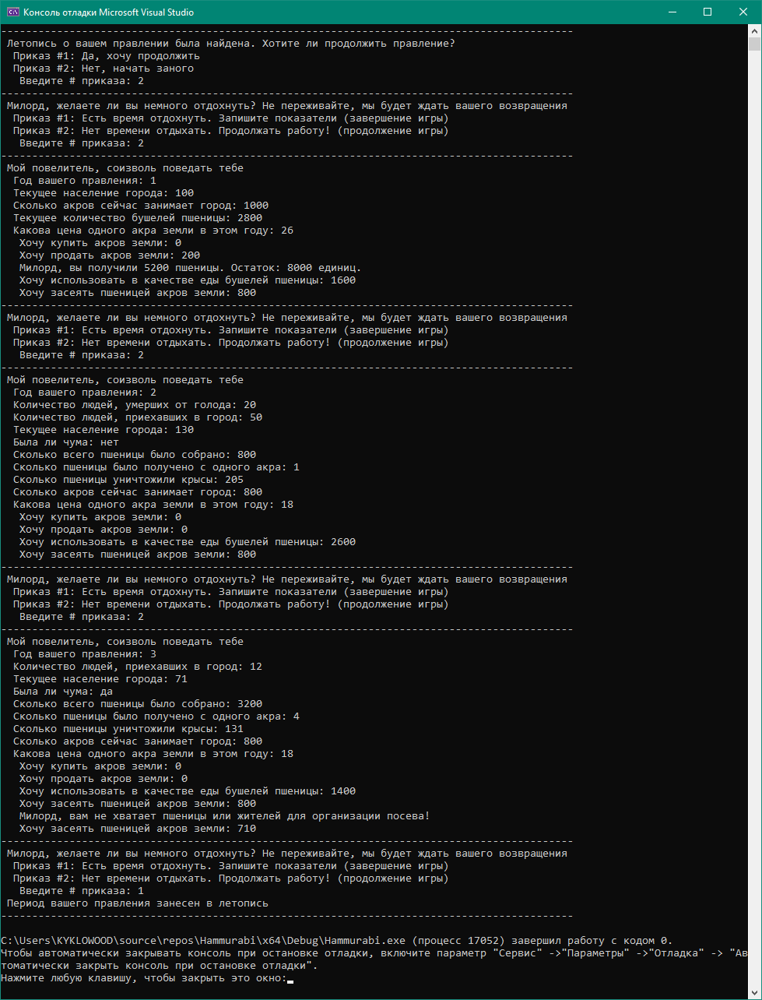

# Хаммураби

Данная ветка содержит реализацию игры Хаммураби.

## Правила игры

Игра состоит из 10 раундов, в течение которых игрок, выступающий в роли правителя древнего Вавилона Хаммурапи, распоряжается ресурсами города. Ресурсами являются: население, акры земли и бушели пшеницы. Каждый раунд представляет один год правления. Каждый гражданин возделывает некоторое количество акров земли, в результате чего производится некоторое количество бушелей пшеницы. Эта пшеница может использоваться либо в качестве еды для граждан (которые при недостатке еды умирают от голода), либо в качестве семян для посева урожая на следующий год. Игрок также может покупать и продавать землю, используя пшеницу как валюту.

Каждый раунд начинается с доклада советника «Мой повелитель, соизволь поведать тебе» о текущем состоянии дел в городе, состоящем из сборов пшеницы за прошлый год, акрах земли, занимаемых городом, и изменении в населении. После чего, советник спрашивает, сколько земли необходимо купить или продать в  этом году, сколько пшеницы использовать на семена, и сколько пшеницы использовать в качестве еды. Игрок отвечает на эти вопросы вводя целые числа.

Игра скрывает от игрока некоторую часть важной информации: правила и коэффициенты расчета параметров за раунд, но это сделано намеренно. Подбор этих параметров является частью игрового процесса.

Разнообразие игре обеспечивает генератор случайных чисел. Цена земли определяется случайным образом в начале каждого раунда. Так же случайным образом определяются количество бушелей пшеницы собранных с каждого акра земли, количество пшеницы, съеденной крысами, и количество новых граждан, прибывших в город в прошлом году. В каждом году есть некоторая вероятность чумы, уменьшающей население города наполовину.

Игра заканчивается после 10 раундов, или ранее, если все население города вымрет, или более 45 процентов населения умрут от голода в течение одного раунда.

## Алгоритм

Игра начинается со следующими параметрами:

- В городе проживает 100 человек
- В закромах города 2800 бушелей пшеницы
- Город занимает 1000 акров земли

В начале каждого раунда игрок видит

- Номер раунда
- Количество людей, умерших от голода (если не было, то не показывается)
- Количество людей, приехавших в город (если не было, то не показывается)
- Была ли чума
- Текущее население города
- Сколько всего пшеницы было собрано и сколько пшеницы было получено с акра
- Сколько пшеницы уничтожили крысы
- Сколько акров сейчас занимает город
- Какова цена одного акра земли в этом году

Цена акра определяется случайно в начале каждого раунда из диапазона от 17 до 26

Затем игрок вводит:

- Количество акров земли, которые он хочет купить
- Количество акров земли, которые он хочет продать
- Количество бушелей пшеницы, которые будут использованы в качестве еды
- Количество акров земли, которые необходимо засеять пшеницей

Игра контролирует вводимые значения, и, если значения оказываются некорректными (например, количество земли, которое хочет купить игрок не может быть оплачено имеющимся пшеницей, или введено отрицательное количество акров земли), выводит соответствующие предупреждения.

Для контроля используются следующие значения (некоторые из них скрыты от игрока, он должен определить их сам):

- Продажа и покупка земли выполняются по текущей цене
- Каждый житель потребляет 20 бушелей пшеницы в год
- Каждый житель может обрабатывать максимум 10 акров земли
- Каждый акр требует 0.5 бушелей пшеницы на семена

Переход к следующему раунду определяется правилами

- Количество пшеницы, собранного с акра определяется случайно из диапазона от 1 до 6
- Крысы съедают случайное количество пшеницы из диапазона от 0 до 0.07\*имеющееся количество бушелей с учетом сборов
- Каждый житель потребляет 20 бушелей пшеницы в раунд, те, кому не хватает еды, умирают от голода
- Если за раунд умерли от голода более 45% населения, игрок сразу же проигрывает
- Количество вновь прибывших определяется по формуле:

умерших\_от\_голода /2 + (5 – сбор\_с\_акра) \* бушелей\_пшеницы / 600 + 1

затем, если это количество меньше 0, берется 0, если больше 50, то 50

- Чума возникает с вероятностью 15%, если это происходит, то население уменьшается наполовину с округлением вниз

После 10 раунда игра вычисляет следующие статистики:

- Среднегодовой процент умерших от голода P
- Количество акров земли на одного жителя L

и выставляет игроку оценку по результатам правления:

- Если P > 33% и L < 7 – плохо («Из-за вашей некомпетентности в управлении, народ устроил бунт, и изгнал вас их города. Теперь вы вынуждены влачить жалкое существование в изгнании»)
- Если P > 10% и L < 9 – удовлетворительно («Вы правили железной рукой, подобно Нерону и Ивану Грозному. Народ вздохнул с облегчением, и никто больше не желает видеть вас правителем»)
- Если P > 3% и L < 10 – хорошо («Вы справились вполне неплохо, у вас, конечно, есть недоброжелатели, но многие хотели бы увидеть вас во главе города снова»)
- В противном случае – отлично («Фантастика! Карл Великий, Дизраэли и Джефферсон вместе не справились бы лучше»)

## Обзор

Ниже представлен скриншот игрового процесса



Файл сохранения оформлен достаточно просто, поэтому уточню:
1.	текущий раунд;
2.	население города;
3.	пшено в закромах;
4.	акры земли;
5.	жертвы голода;
6.	акры под посев;
7.	% смертности от голода.
   
## Примечание
 
Относительно структуры программы сильно не заморачивался, старался сделать так, чтобы все функции по заданию работали.

Игровые параметры:

1.  Важные:
constexpr int kRounds = 10;         //игра состоит из 10 раундов
constexpr int kPopulation = 100;    //стартовое количество людей
constexpr double kWheat = 2800.0;   //стартовое количество пшена
constexpr int kAcre = 1000;	    //стартовое количество акров
std::string path = "saveFile.txt";  //имя файла сохранения

2.  Второстепенные (вычисляются в процессе игры), опираются на "важные" параметры:
int currentNewResidents;            //количество людей, прибывших в город
int currentAcreHarvest;             //текущий сбор пшеницы
int currentAcreCost;                //текущая стоимость акра
int currentRatEatenWheat;           //текущее количество съеденого крысами пшена
bool isPlague;                      //была ли чума?
int acresWannnaBuy;                 //количество акров для покупки (вводится игроком)
int acresWannaSell;                 //количество акров на продажу (вводится игроком)
int wheatWannaEat;                  //количество пшена на еду жителям (вводится игроком)
int acresPerResidents;              //элемент статистики (количество акров на одного жителя)

3.  Структура, содержащая важные игровые параметры, без которых невозможно запустить игровой процесс повторно (допустим, с сохранения)
```
struct Round {
	int currentRound;                //текущее значение раунда
	int currentPopulation;	         //текущее количество людей
	double currentWheat;             //текущее количество пшена
	int currentAcre;	               //текущее количество акров
	int currentStarvationVictims;    //текущее количество жертв голода
	int currentAcreSow;              //количество акров под посев (вводится игроком)
	double starvPerDeaths;           //элемент статистики (среднегодовой процент умерших от голода)
};
```

Описание функций:
1.  getAcreCost() - получить цену акра в текущем раунде (от 17 до 26)
2.  getAcreWheat() - получить сбор пшеницы с акра в текущем раунде (от 1 до 6)
3.  getRatEatenWheat(double wheat) - получить величину съеденного крысами зерна в текущем раунде (от 0 до 0.07 * текущее количество зерна с учетом сборов)
4.  getPlague() - получить шанс возникновения чумы (15%)
5.  getNewResidents(int starvationVictims, int acreHarvest, double currentWheat) - получить величину вновь прибивших жителей в текущем раунде
6.  inputInt(int min = INT_MIN, int max = INT_MAX) - проверка ввода данных, принимает только целые числа, исключая всё остальное (буквы, символы, вещественные)
7.  wannaEat(Round game) - проверка ввода количества пшена на пищу жителям. Делает также проверку, опираясь на количество жителей, чтобы зря не потратить пшено.
8.  wannaSow(Round game) - проверка ввода количества пшена на посев. Делает также проверку на количество зерна и количество рабочих рук для организации посева.
9.  saveGame(Round game) - функция сохранения прогресса игрока. Спрашивает игрока о необходимости сохранить прогресс при каждом начале раунда.
10. gameplay(Round game) - функция, содержащая в себе цикл, симулирующий игровой процесс.
11. main() - спрашиваю игрока нужно ли запустить файл сохранения или же стоит начать новую игру
