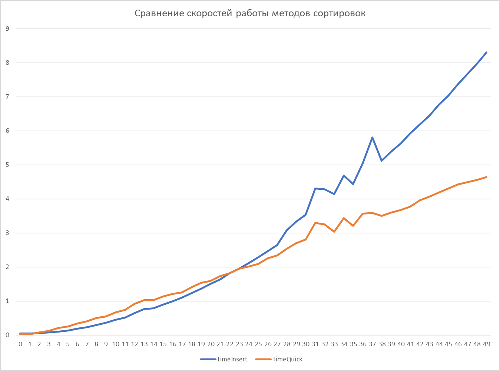

# Сортировка

Данная ветка содержит реализацию и сравнение алгоритмов сортировки: сортировка вставками, быстрая сортировка (quicksort) и шибридная сортировка (quicksort с переходом на сортировку вставками при малых размерах массива)

## Задание

В вашу задачу входит разработка обобщенной функции `sort()`, реализующей алгоритм быстрой сортировки со следующими оптимизациями:

- Выбор опорного элемента, как медианы из первого, среднего и последнего элемента сортируемого интервала;
- Исключение хвостовой рекурсии: функция должна определять длины получившихся интервалов после разбиения и рекурсивно сортировать интервал меньшей длины, итеративно обрабатывая интервал большей длины;
- Использование алгоритма сортировки вставками для коротких интервалов (длину такого интервала необходимо подобрать экспериментально).
- Использовать move-семантику для обмена элементов в процессе разбиения и при сортировке вставками.

Функция должна принимать три аргумента: начало `first` и конец `last` сортируемого интервала и предикат сортировки comp,который принимает два аргумента – элементы массива `a` и `b`, и возвращает true, если `a < b`, то есть в отсортированном массиве элемент `a` должен располагаться *перед* `b`.
```
template<typename T, typename Compare>
void sort(T \*first, T \*last, Compare comp)
```
где предикат упорядочивания должен удовлетворять прототипу 
```
template<typename T>
bool comp(const T &a, const T &b)
```
Сортировка массива из 100 целых чисел при помощи разработанной функции будет выглядеть следующим образом:
```
int a[100];
sort(a, a + 100, [](int a, int b) { return a < b; });
```
Для разработанной функции необходимо создать набор модульных тестов (например, Google Test или CppUnit). Тесты должны быть репрезентативными, покрывать общий и максимальное количество граничных случаев. Тесты должны покрывать случаи сортировки массивов из элементов как примитивных, так и нетривиальных типов.

## Обзор

Описание методов:

  1. ``` void InsertionSort(T* first, T* last, Compare comp) ``` - функция сортировки вставками

  2. ``` T FindMedian (T& a, T& b, T& c, Compare compare) ``` - функция поиска медианного значения

  3. ``` void QuickSort(T* first, T* last, Compare compare, bool useInsertionSort = true) ``` - функция быстрой сортировки

  4. ``` <другие элементы> ``` - функция замера времени и вспомогательные элементы

Модульные тесты сделаны на базе CppUnitTestFramework и содержат проверку функций сортировок

Сравнение методов сортировок представлено на скриншоте ниже



Были получены графики времени работы алгоритмов сортировки вставками и quicksort от размера массива, из которых видно, что оптимальное значение размера перехода на другой алгоритм должно быть равно 22.
